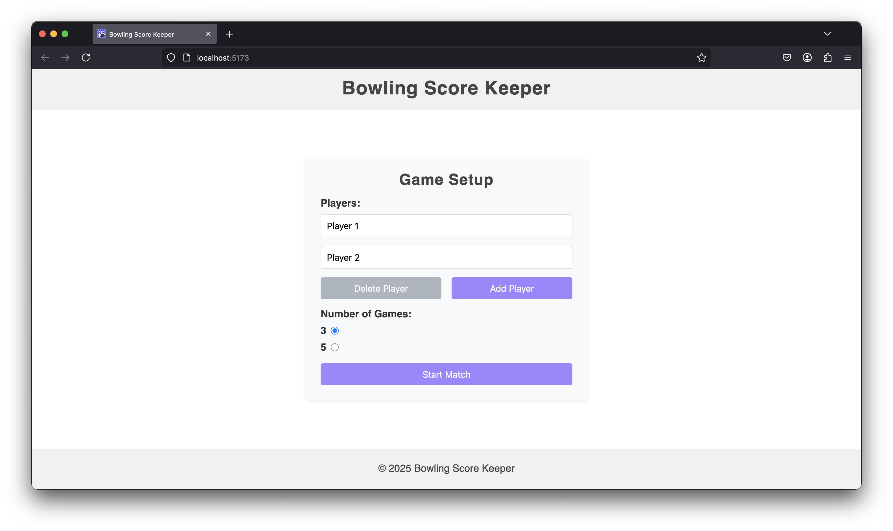
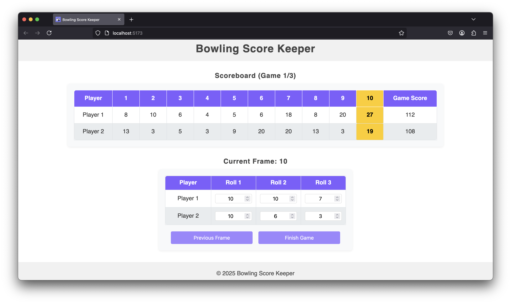
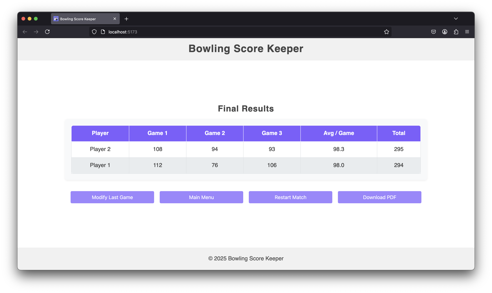

# 🎳 Bowling Score Keeper

[](https://react.dev/)
[](https://vitejs.dev/)
[](https://developer.mozilla.org/en-US/docs/Web/JavaScript)
[](https://developer.mozilla.org/en-US/docs/Web/Guide/HTML/HTML5)
[](https://developer.mozilla.org/en-US/docs/Web/CSS)

Bowling Score Keeper is a React + Vite web application for tracking bowling scores for multiple players in real time. It was built as part of a front-end development course to learn React by creating a real scoring system for a bowling game.

> ℹ️ This version was re-uploaded for personal use and further development.  
> The original team project with full commit history is available here:  
> 👉 [iivariepic/Bowling-Score-Keeper](https://github.com/iivariepic/Bowling-Score-Keeper)

## ✨ Features

- Add 2 to 4 players
- Select match length (3 or 5 games)
- Track frame-by-frame scores
- Apply bonus points for strikes and spares
- Correctly handle special rules for the 10th frame
- Real-time score updates and winner declaration
- Export final results as a PDF
- Responsive and user-friendly interface

## 📸 Screenshots

<h3 align="center">Menu</h3>



<h3 align="center">Gameplay</h3>



<h3 align="center">Results</h3>



## 🧰 Stack

- React (functional components, hooks, Context API)
- Vite (development environment)
- Custom CSS styling

## 🚀 Setup

1. Clone the repository
2. Install dependencies

```bash
npm install
```

3. Start the development server

```bash
npm run dev
```

The application will be available at `http://localhost:5173/` by default.
